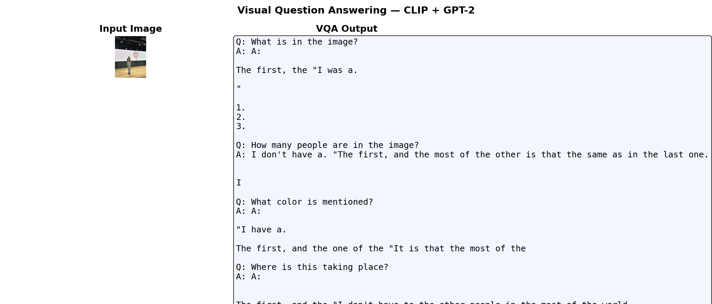

# CLIP + GPT-2 Image Captioning with VQA Extension

A deep learning project that generates natural language captions for images by combining **CLIP** image embeddings with **GPT-2** text generation using a learned prefix mapping. Includes a **Visual Question Answering (VQA)** extension that answers natural language questions about images.

---

## Demo

| Image Captioning | Visual Question Answering |
|:---:|:---:|
|  |  |

---

## How It Works

```
Image → CLIP (ViT-B/32) → 512-dim embedding
                              ↓
                    Prefix Projection Network
                              ↓
              [Image Prefix Tokens | Text Tokens] → GPT-2 → Caption
```

1. **CLIP** encodes the image into a 512-dimensional embedding
2. A **prefix projection network** maps the embedding into 8 learnable prefix tokens (768-dim each)
3. **GPT-2** takes `[image prefix | text tokens]` and generates the caption autoregressively
4. For **VQA**, the question is appended after the image prefix: `[image prefix | Question: ... Answer:]`

---

## Project Structure

```
CLIP-GPT2-Image-Captioning/
│
├── VQA extension.ipynb        # Main notebook: captioning + VQA training & demo
├── captions_5k.json           # Flickr8k captions (5,000 images)
├── clip_embeddings_5k.npy     # Precomputed CLIP embeddings for 5k images
│
├── caption_gallery.png        # Sample captioning results
├── demo_result.png            # Captioning demo output
├── vqa_demo.png               # VQA demo output (ViLT)
├── improved_training_curve.png # Training loss curve
├── metrics_comparison.png     # Evaluation metrics comparison
├── sensitivity_analysis.png   # Sensitivity analysis results
│
├── improved_prefix_best.pt    # [Google Drive] Best captioning model weights
├── vqa_weights.pt             # [Google Drive] VQA model weights
│
└── .gitignore
```

---

## Model Weights

The `.pt` model files are too large for GitHub and are hosted on Google Drive:

| File | Description | Link |
|------|-------------|------|
| `improved_prefix_best.pt` | Best captioning model (~513 MB) | [Download](https://drive.google.com/file/d/1Z0T6DZlWc55uOZVx9nGdve_KtSdokHCj/view?usp=sharing) |
| `vqa_weights.pt` | VQA model weights (~495 MB) | [Download](https://drive.google.com/file/d/1xRFBTRdADj7PGuBZpf4whu_n730993t4/view?usp=sharing) |

Download and place them in the same directory as the notebook before running.

---

## VQA Extension

The VQA module answers questions like:

- *"What is in the image?"*
- *"How many people are in the image?"*
- *"What color is the main object?"*
- *"Where is this taking place?"*

Two approaches are implemented:

| Approach | Model | Notes |
|----------|-------|-------|
| Custom | CLIP + GPT-2 prefix | Trained on auto-generated QA pairs from Flickr8k captions |
| Pretrained | ViLT (`dandelin/vilt-b32-finetuned-vqa`) | CPU-friendly, plug-and-play |

### VQA Training Results

| Epoch | Loss |
|-------|------|
| 1 | 1.4536 |
| 2 | 1.0481 |
| 3 | 0.9042 |
| 4 | 0.7820 |
| 5 | 0.6641 |

---

## Setup & Usage

### Requirements

```bash
pip install torch torchvision
pip install git+https://github.com/openai/CLIP.git
pip install transformers==4.40.0 datasets
```

### Run in Google Colab (Recommended)

1. Open `VQA extension.ipynb` in Google Colab
2. Mount your Google Drive and set `DRIVE_PATH` to the folder containing the model weights
3. Run all cells

### Local Usage

```python
import torch
import clip
from transformers import GPT2Tokenizer, GPT2LMHeadModel
from PIL import Image

# Load CLIP
device = "cuda" if torch.cuda.is_available() else "cpu"
clip_model, preprocess = clip.load("ViT-B/32", device=device)

# Load your image
image = preprocess(Image.open("your_image.jpg")).unsqueeze(0).to(device)

# Get CLIP embedding
with torch.no_grad():
    embedding = clip_model.encode_image(image)

# Load captioning model and generate caption
# (see notebook for full inference code)
```

---

## Dataset

- **Flickr8k** — 5,000 images with captions loaded via Hugging Face `datasets`
- CLIP embeddings precomputed and saved as `clip_embeddings_5k.npy`
- VQA pairs auto-generated from captions using rule-based templates (7,372 QA pairs from 4,000 images)

---

## Tech Stack

| Component | Technology |
|-----------|------------|
| Image Encoder | CLIP ViT-B/32 (OpenAI) |
| Text Generator | GPT-2 (Hugging Face) |
| VQA (pretrained) | ViLT `dandelin/vilt-b32-finetuned-vqa` |
| Training | PyTorch, AdamW, AMP (mixed precision) |
| Dataset | Flickr8k via Hugging Face Datasets |
| Environment | Google Colab (GPU) |

---

## Course

**IE 7615** — Optional Extension: Visual Question Answering
