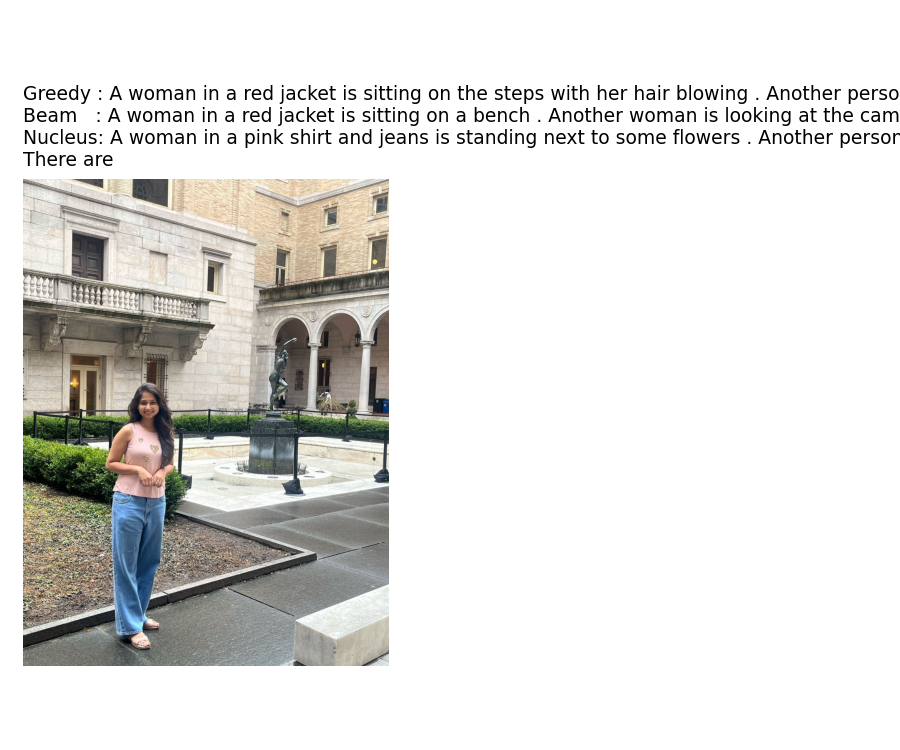

# CLIP + GPT-2 Image Captioning

A deep learning project that generates natural language captions for images by combining **CLIP** image embeddings with **GPT-2** text generation using a learned prefix mapping.

---

## Demo




---

## How It Works

```
Image → CLIP (ViT-B/32) → 512-dim embedding
                              ↓
                    Prefix Projection Network
                              ↓
              [Image Prefix Tokens | Text Tokens] → GPT-2 → Caption
```

1. **CLIP** encodes the image into a 512-dimensional embedding
2. A **prefix projection network** maps the embedding into 8 learnable prefix tokens (768-dim each)
3. **GPT-2** takes `[image prefix | text tokens]` and generates the caption autoregressively

---

## Project Structure

```
CLIP-GPT2-Image-Captioning/
│
├── captions_5k.json            # Flickr8k captions (5,000 images)
├── clip_embeddings_5k.npy      # Precomputed CLIP embeddings for 5k images
│
├── caption_gallery.png         # Sample captioning results
├── demo_result.png             # Captioning demo output
├── improved_training_curve.png # Training loss curve
├── metrics_comparison.png      # Evaluation metrics comparison
├── sensitivity_analysis.png    # Sensitivity analysis results
│
├── improved_prefix_best.pt     # [Google Drive] Best captioning model weights
│
└── .gitignore
```

---

## Model Weights

The model file is too large for GitHub and is hosted on Google Drive:

| File | Description | Link |
|------|-------------|------|
| `improved_prefix_best.pt` | Best captioning model (~513 MB) | [Download](https://drive.google.com/file/d/1Z0T6DZlWc55uOZVx9nGdve_KtSdokHCj/view?usp=sharing) |
| `prefix_weights.pt` | Prefix conditioning model (~490 MB) | [Download](https://drive.google.com/file/d/1bBe4j5j1S9PTppCWJidKB03kozyQUaYk/view?usp=sharing) |
| `cross_attn_weights.pt` | Cross-attention model (~486 MB) | [Download](https://drive.google.com/file/d/1KuVSKnFtWjkdlYawO33_m8a0smADfVff/view?usp=sharing) |
| `lora_weights.pt` | LoRA fine-tuned model (~491 MB) | [Download](https://drive.google.com/file/d/1q3-bb_GED3hMBNczER_vJh-7bMZ0HFiX/view?usp=sharing) |

Download and place them in the same directory as the notebook before running.

---

## Setup & Usage

### Requirements

```bash
pip install torch torchvision
pip install git+https://github.com/openai/CLIP.git
pip install transformers==4.40.0 datasets
```

### Run in Google Colab (Recommended)

1. Mount your Google Drive and set `DRIVE_PATH` to the folder containing the model weights
2. Run all cells

### Local Usage

```python
import torch
import clip
from transformers import GPT2Tokenizer, GPT2LMHeadModel
from PIL import Image

device = "cuda" if torch.cuda.is_available() else "cpu"
clip_model, preprocess = clip.load("ViT-B/32", device=device)

# Get CLIP embedding
image = preprocess(Image.open("your_image.jpg")).unsqueeze(0).to(device)
with torch.no_grad():
    embedding = clip_model.encode_image(image)

# Load captioning model and generate caption
# (see notebook for full inference code)
```

---

## Dataset

- **Flickr8k** — 5,000 images with captions loaded via Hugging Face `datasets`
- CLIP embeddings precomputed and saved as `clip_embeddings_5k.npy`

---

## Tech Stack

| Component | Technology |
|-----------|------------|
| Image Encoder | CLIP ViT-B/32 (OpenAI) |
| Text Generator | GPT-2 (Hugging Face) |
| Training | PyTorch, AdamW, AMP (mixed precision) |
| Dataset | Flickr8k via Hugging Face Datasets |
| Environment | Google Colab (GPU) |

---

## Course

**IE 7615** — Generative AI Project
